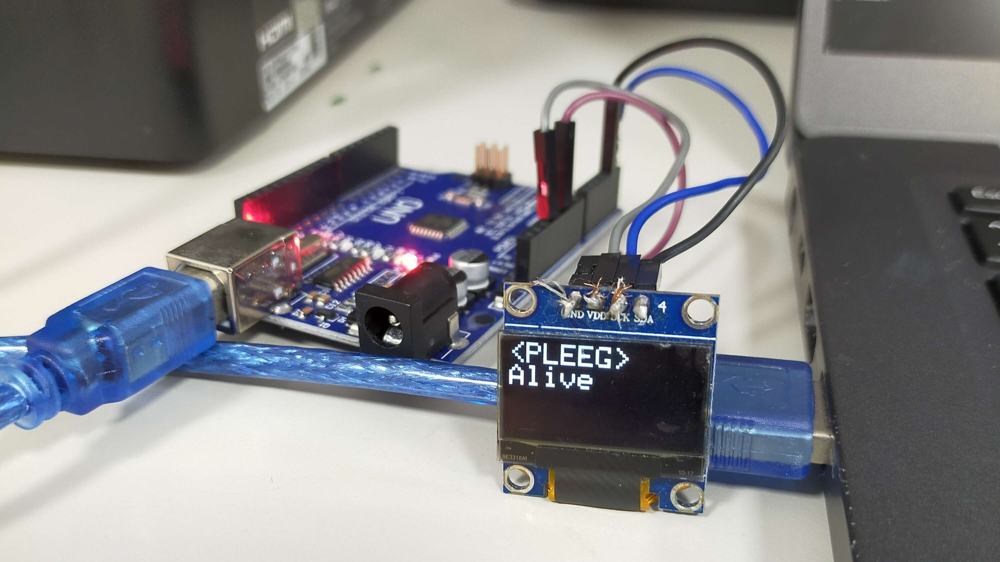

<div align=center>


# Sparduino
在Arduino顯示Spotify目前播放音樂
</div>



## 安裝

* 請先安裝 `Adafruit_SSD1306` (詢問是否要安裝其依賴請點是)
* 使用任意方法將`[code.ino](code.ino)`燒入至任意Arduino。若使用其他顯示器請自行微調程式。

## 使用

至release下載並開啟軟體，或下載Python檔執行。

```
╦ 歡迎使用 Sparduino
║
╠ 目前可用接口:
╠═ COM5 - USB-SERIAL CH340 (COM5)
╠═ COM6 - USB-SERIAL CH340 (COM6)
║
╚ 輸入數字: 5
╔ PLEEG
╚ Alive
```
